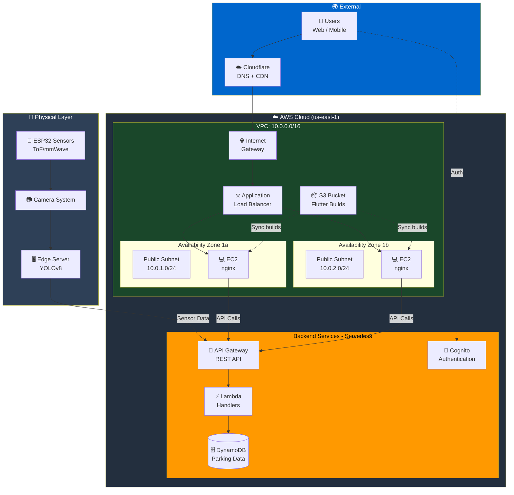
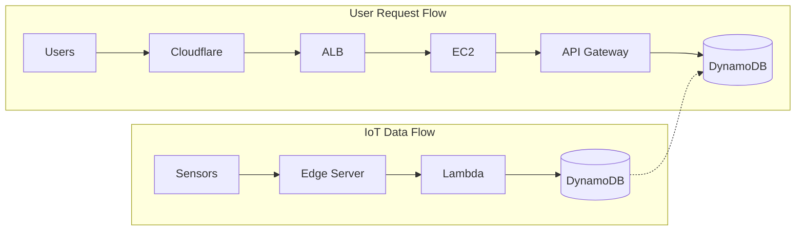
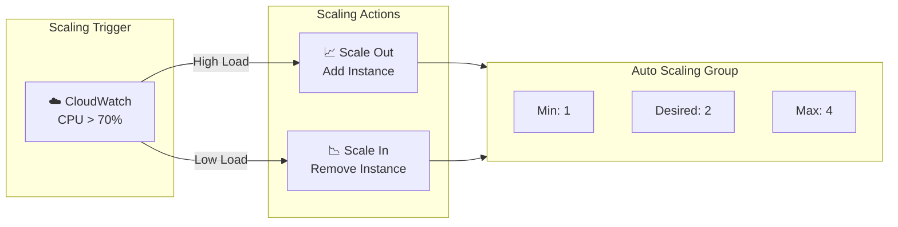
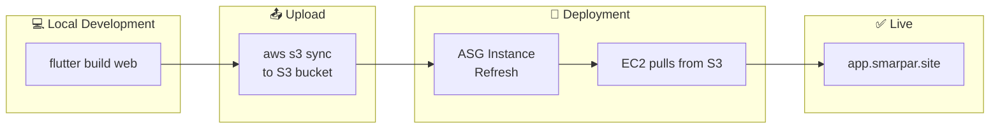

# Smart Parking System - Infrastructure

## Complete System Architecture

```
┌─────────────────────────────────────────────────────────────────────────────────────┐
│                                    PHYSICAL LAYER                                   │
│  ┌─────────────────────┐    ┌─────────────────────┐    ┌─────────────────────────┐  │
│  │   Parking Sensors   │    │   Camera System     │    │    Edge Server          │  │
│  │   (ESP32 + ToF/     │───▶│   (Vehicle Detection│───▶│    (YOLOv8 Processing)  │  │
│  │    mmWave)          │    │    Feed)            │    │                         │  │
│  └─────────────────────┘    └─────────────────────┘    └───────────┬─────────────┘  │
└────────────────────────────────────────────────────────────────────┼────────────────┘
                                                                     │
                                                                     ▼
┌─────────────────────────────────────────────────────────────────────────────────────┐
│                              AWS CLOUD (us-east-1)                                  │
│                                                                                     │
│  ┌─────────────────────────────────────────────────────────────────────────────┐   │
│  │                     BACKEND SERVICES (Serverless)                           │   │
│  │  ┌──────────────┐    ┌──────────────┐    ┌──────────────┐    ┌────────────┐ │   │
│  │  │  API Gateway │───▶│    Lambda    │───▶│   DynamoDB   │    │  Cognito   │ │   │
│  │  │  (REST API)  │    │  (Handlers)  │    │  (Parking    │    │  (Auth)    │ │   │
│  │  │              │    │              │    │   Data)      │    │            │ │   │
│  │  └──────────────┘    └──────────────┘    └──────────────┘    └────────────┘ │   │
│  └─────────────────────────────────────────────────────────────────────────────┘   │
│                                         ▲                              ▲           │
│                                         │                              │           │
│  ┌──────────────────────────────────────┼──────────────────────────────┼───────┐   │
│  │                    FRONTEND INFRASTRUCTURE (VPC: 10.0.0.0/16)       │       │   │
│  │                                                                              │   │
│  │      ┌─────────────────────────┐    ┌─────────────────────────┐             │   │
│  │      │    Availability Zone    │    │    Availability Zone    │             │   │
│  │      │        us-east-1a       │    │        us-east-1b       │             │   │
│  │      │  ┌───────────────────┐  │    │  ┌───────────────────┐  │             │   │
│  │      │  │  Public Subnet    │  │    │  │  Public Subnet    │  │             │   │
│  │      │  │  10.0.1.0/24      │  │    │  │  10.0.2.0/24      │  │             │   │
│  │      │  │   ┌─────────┐     │  │    │  │   ┌─────────┐     │  │             │   │
│  │      │  │   │   EC2   │     │  │    │  │   │   EC2   │     │  │             │   │
│  │      │  │   │ (nginx) │     │  │    │  │   │ (nginx) │     │  │             │   │
│  │      │  │   └─────────┘     │  │    │  │   └─────────┘     │  │             │   │
│  │      │  └───────────────────┘  │    │  └───────────────────┘  │             │   │
│  │      └─────────────────────────┘    └─────────────────────────┘             │   │
│  │                    ▲                          ▲                              │   │
│  │                    └──────────┬───────────────┘                              │   │
│  │                    ┌──────────┴──────────┐   ┌──────────────┐                │   │
│  │                    │  Application Load   │   │  S3 Bucket   │                │   │
│  │                    │     Balancer        │   │  (Builds)    │                │   │
│  │                    └──────────┬──────────┘   └──────────────┘                │   │
│  │                               │                                              │   │
│  └───────────────────────────────┼──────────────────────────────────────────────┘   │
│                       ┌──────────┴──────────┐                                       │
│                       │  Internet Gateway   │                                       │
│                       └──────────┬──────────┘                                       │
└──────────────────────────────────┼──────────────────────────────────────────────────┘
                                   │
                        ┌──────────┴──────────┐
                        │     Cloudflare      │
                        │   (DNS + CDN)       │
                        └──────────┬──────────┘
                                   │
                              ┌────┴────┐
                              │  Users  │
                              │ (Web,   │
                              │  Mobile)│
                              └─────────┘
```

---

## Data Flow

```
Sensors → Edge Server → Lambda → DynamoDB
                                    ↓
Users ← Cloudflare ← ALB ← EC2 ← API Gateway ← DynamoDB
                            ↑
                    Cognito (Auth)
```

---

## Network Configuration

| Component            | Name                     | Configuration       |
| -------------------- | ------------------------ | ------------------- |
| **VPC**              | smarpar-vpc              | CIDR: `10.0.0.0/16` |
| **Subnet (AZ-1a)**   | smarpar-subnet-public-1a | CIDR: `10.0.1.0/24` |
| **Subnet (AZ-1b)**   | smarpar-subnet-public-1b | CIDR: `10.0.2.0/24` |
| **Internet Gateway** | smarpar-igw              | Attached to VPC     |
| **Route Table**      | smarpar-rtb-public       | `0.0.0.0/0 → IGW`   |

---

## Compute Resources

| Component              | Name                 | Configuration              |
| ---------------------- | -------------------- | -------------------------- |
| **Launch Template**    | smarpar-web-template | AMI: Amazon Linux 2023     |
| **Instance Type**      | t3.small             | 2 vCPU, 2 GB RAM           |
| **Auto Scaling Group** | smarpar-asg          | Min: 1, Desired: 2, Max: 4 |
| **Scaling Policy**     | Target Tracking      | CPU Utilization 70%        |

---

## Load Balancing

| Component         | Name            | Configuration              |
| ----------------- | --------------- | -------------------------- |
| **Load Balancer** | smarpar-alb     | Application Load Balancer  |
| **Scheme**        | Internet-facing | Public access              |
| **Target Group**  | smarpar-tg      | HTTP:80, Health check: `/` |
| **Listener**      | HTTP:80         | Forward to target group    |

---

## Security Groups

### ALB Security Group (smarpar-alb-sg)

| Direction | Protocol | Port | Source    |
| --------- | -------- | ---- | --------- |
| Inbound   | HTTP     | 80   | 0.0.0.0/0 |
| Inbound   | HTTPS    | 443  | 0.0.0.0/0 |
| Outbound  | All      | All  | 0.0.0.0/0 |

### EC2 Security Group (smarpar-ec2-sg)

| Direction | Protocol | Port | Source              |
| --------- | -------- | ---- | ------------------- |
| Inbound   | HTTP     | 80   | smarpar-alb-sg      |
| Inbound   | SSH      | 22   | Admin IP (optional) |
| Outbound  | All      | All  | 0.0.0.0/0           |

---

## Storage

| Component      | Name                   | Purpose                   |
| -------------- | ---------------------- | ------------------------- |
| **S3 Bucket**  | smarpar-flutter-builds | Flutter web build storage |
| **EBS Volume** | gp3 (default)          | EC2 root volume           |

---

## Backend Services (Serverless)

| Service              | Purpose                             |
| -------------------- | ----------------------------------- |
| **API Gateway**      | REST API endpoint                   |
| **Lambda Functions** | Business logic (parking operations) |
| **DynamoDB**         | NoSQL database for parking data     |
| **Cognito**          | User authentication                 |

---

## DNS & CDN

| Provider       | Record             | Target               |
| -------------- | ------------------ | -------------------- |
| **Cloudflare** | `app.smarpar.site` | ALB DNS name (CNAME) |

---

## High Availability Features

| Feature                 | Implementation                             |
| ----------------------- | ------------------------------------------ |
| **Multi-AZ Deployment** | EC2 instances in 2 Availability Zones      |
| **Auto Scaling**        | Automatic instance scaling (1-4 instances) |
| **Load Balancing**      | ALB distributes traffic across instances   |
| **Health Checks**       | ALB monitors instance health               |
| **Instance Refresh**    | Zero-downtime deployments                  |

---

## Deployment Flow

```
┌─────────────┐     ┌─────────────┐     ┌─────────────┐     ┌─────────────┐
│   Local     │     │     S3      │     │  Instance   │     │    EC2      │
│   Build     │────▶│   Upload    │────▶│   Refresh   │────▶│   Updated   │
│             │     │             │     │             │     │             │
└─────────────┘     └─────────────┘     └─────────────┘     └─────────────┘
   flutter            s3 sync            ASG refresh         New instances
   build web                             (rolling)           pull from S3
```

---

## Cost Optimization

| Strategy                 | Benefit                      |
| ------------------------ | ---------------------------- |
| **t3.small instances**   | Burstable, cost-effective    |
| **S3 for static builds** | Cheaper than EBS for storage |
| **Auto Scaling**         | Pay only for needed capacity |
| **Serverless backend**   | Lambda: pay-per-request      |

---

## Mermaid Architecture Diagram



---

## Simplified Flow Diagram



---

## Auto Scaling Flow



---

## Deployment Pipeline


